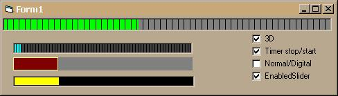



## ProgressBar and Slider

### Description

ProgressBar and Slider in one to the component. Different sorts of mapping. Handle of sorts of cursors. Certainly it is possible to make and better but me arranges. Excuse for mine English.
 
### More Info
 

             |
---                |---
**Submitted On**   |2000-12-13 17:26:36
**By**             |[Nik Tupkalov](https://github.com/Planet-Source-Code/PSCIndex/blob/master/ByAuthor/nik-tupkalov.md)
**Level**          |Beginner
**User Rating**    |3.8 (19 globes from 5 users)
**Compatibility**  |VB 4\.0 \(32\-bit\), VB 5\.0, VB 6\.0
**Category**       |[Custom Controls/ Forms/  Menus](https://github.com/Planet-Source-Code/PSCIndex/blob/master/ByCategory/custom-controls-forms-menus__1-4.md)
**World**          |[Visual Basic](https://github.com/Planet-Source-Code/PSCIndex/blob/master/ByWorld/visual-basic.md)
**Archive File**   |[CODE\_UPLOAD1267312132000\.zip](https://github.com/Planet-Source-Code/nik-tupkalov-progressbar-and-slider__1-13583/archive/master.zip)

